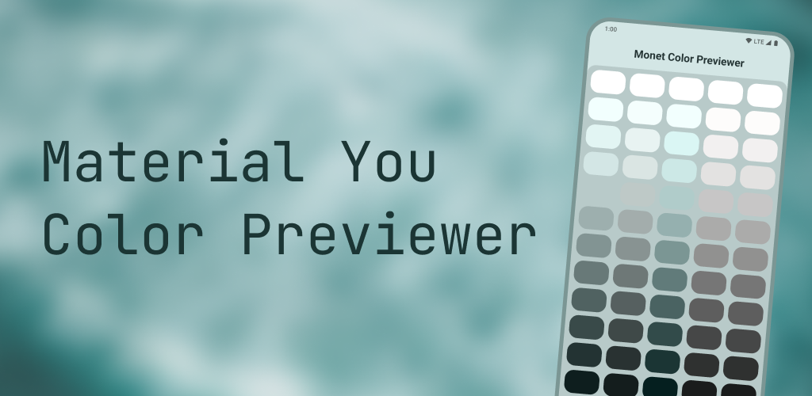
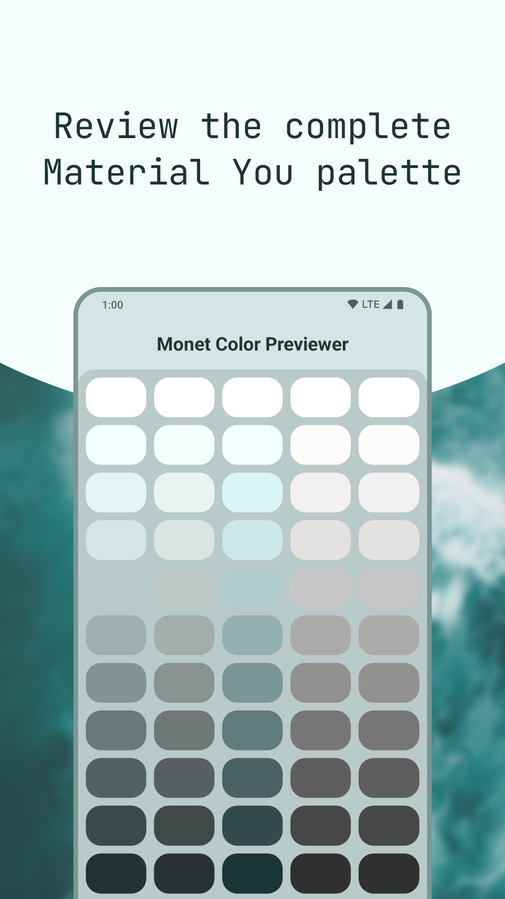
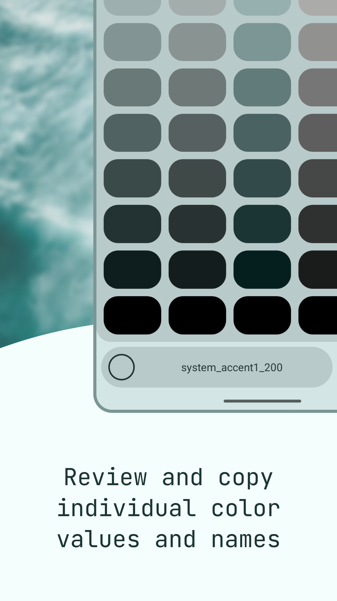
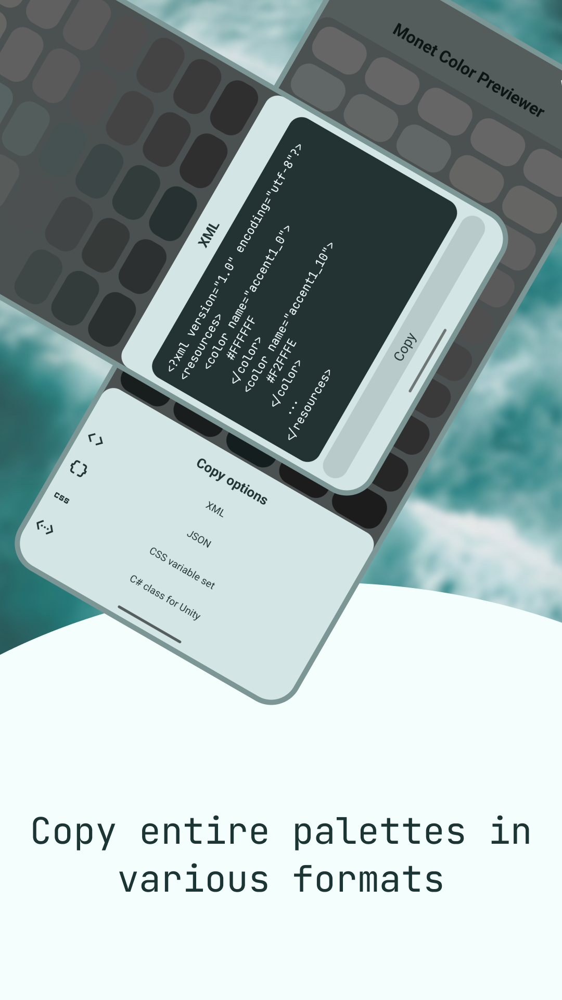

    

    
    
    

    
    

Use this simple app to view all available Material You colors. This app will also show you the actual color ID for you to easily use it in your project.

You can also copy the full list of Monet Colors, as they are set on your device, in the following formats: XML list for Android app development, JSON object, set of CSS variables and a C# class for Unity.

Moreover, the app now works on devices which run under API lower than 31 (Android 12). In such cases app will use a fallback set of colors (blue-ish Monet theme, as the one used in apps like Google Dialer on devices running API 30 and lower).

## Known issues

### Sudden crashes

When changing the UI state on your device (e.g. switching from light to dark theme) the app will most likely crash. It may crash in some cases when you are changing its activity state (e.g. returning to the app from a home screen or "Recent applications" screen). The cause of these crashes is the [android-maskable-layout library](https://github.com/Smooth-E/android-maskable-layout) which I am using to cut inner UI elements of rounded-cornered dialogs and scrollable views. Since this library is very outdated (last update in 2020, migrated to AndroidX by me in early spring 2023) I am planning to either replace it with Android's new `ShapeableImageView` where possible or patch the existing library further to resolve mentioned crashes.

### Inconsistent experience on different Android versions

Navigation bar looks differently on different API versions:

- Android 6 - Android 9 - navigation bar has a blue background and light icons
- Android 10 and Android 11 - navigation bar has a dimmed background and light icons
- Android 12 and others (hopefully) - navigation bar background is blue with dark icons (intended behavior)

It all started when I realized that Android has a very annoying bug in somewhat recent versions of it: when you want a window to slowly slide from below the screen on entrance and are making to interpolate it's Y position between -100% and 0%, it moves slightly higher (as if the top edge of the navigation bar was the bottom edge of the screen) and then immediately jumps back to where it should've stopped. It turned out that is I set the `android:windowIsFloating` flag to `true`, the animation will perform just fine. However. with this flag enabled, another problem appeared. It turns out, that on older API versions if the window is floating, then on API 23 the bottom inset for it is always 0, and on API 24 to 27 the navigation bar is dimmed. Then I made separate themes for different API versions, but didn't come up with a solution on how to remove dimness on Android 10 and Android 11.

This is why you will get somewhat inconsistent experience on different Android versions. In future releases I am planning to reimplement these bottom dialogs with `ModalBottomSheet`s and overall redesign the app, since for now it is not really built with Material 3 guidelines in mind.

> Stay tuned for the next release!

## Licensing and resources

Monet Color Previewer is licensed under the [BSD 2-Clause License](./LICENSE). You can use it freely, but I do not give any warranties. Also, if you find this app useful, it will be nice of you to share it with others and not forget to give me a credit.

This project also uses external resources and libraries: 
- [JetBrains Mono Font](https://www.jetbrains.com/lp/mono/) 
- [Google Material Icons](https://fonts.google.com/icons?icon.style=Two+tone&icon.set=Material+Icons)
- [android-maskable-layout](https://github.com/Smooth-E/android-maskable-layout)
- [Google Material](https://github.com/material-components/material-components-android)
- [AndroidX Libraries](https://github.com/androidx/androidx)
