

 
    

<h1 style = "text-align: center;"> Material You Color Previewer </h1>

Use this simple app to view all available Material You colors. App will also show you the actual color ID, so you will be able to easily use it in your project.

Recently, more features had been added, so now you can copy full list of Monet Colors, as they ar set on your device. Available formats for copying the full palette of colors are the following: XML list for Android app development, JSON object, set of CSS variables and a C# class for Unity.

Moreover, the app now works on devices which run under API lower than 31 (Android 12). In such cases app will use a fallback set of colors (blue-ish Monet theme, as the one used in apps like Google Dialer on devices running API 30 and lower).

<h2 align = "center"> Screenshots </h2>

<table align="center">
    <tr>
        <td>
            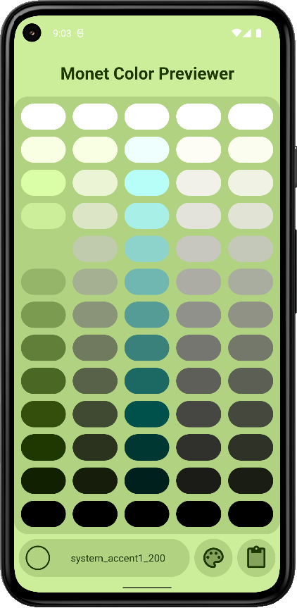
        </td>
        <td>
            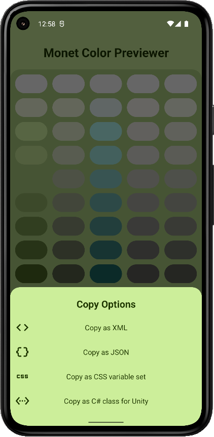
        </td>
        <td>
           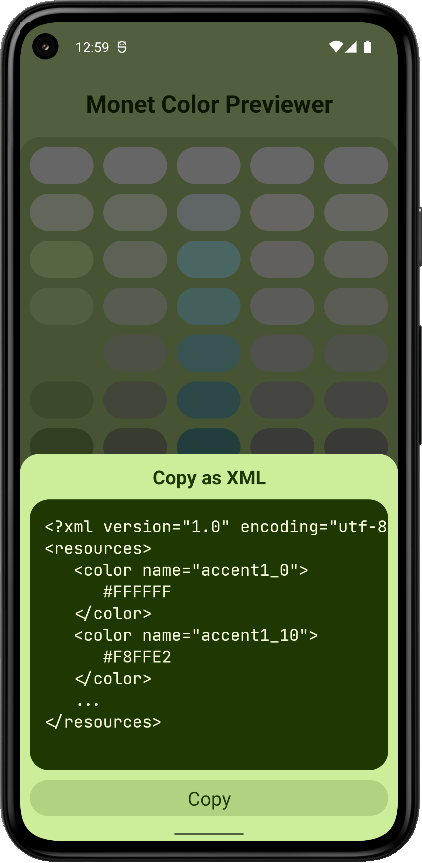
        </td>
    </tr>
        <tr>
        <td>
            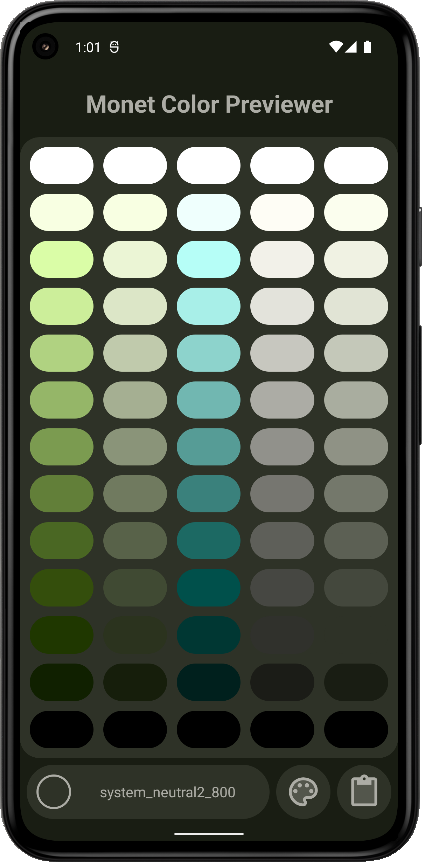
        </td>
        <td>
            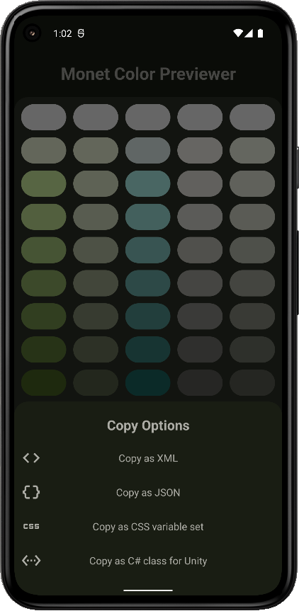
        </td>
        <td>
           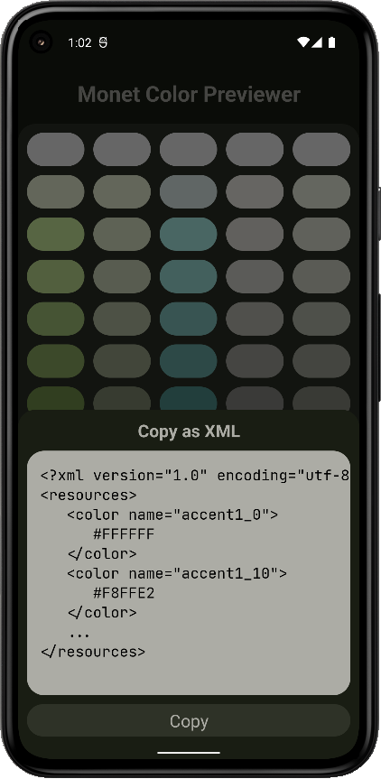
        </td>
    </tr>
</table>

<h2 align = "center"> Screenshots (Android 11 and lower) </h2>

<table align="center">
    <tr>
        <td>
            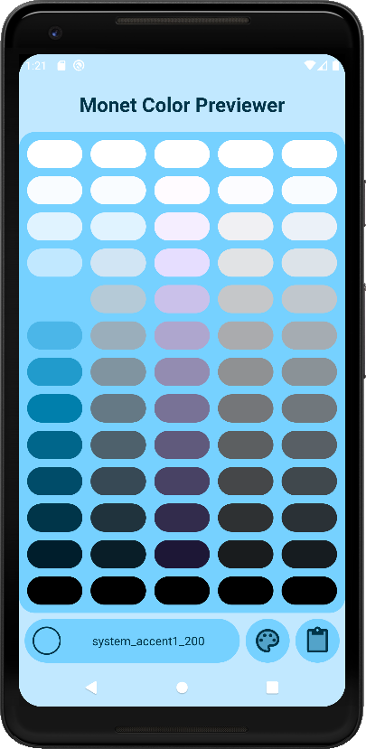
        </td>
        <td>
            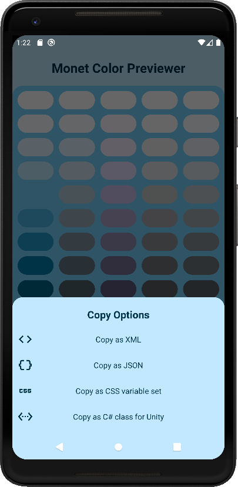
        </td>
        <td>
            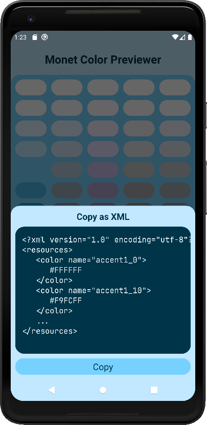
        </td>
    </tr>
        <tr>
        <td>
            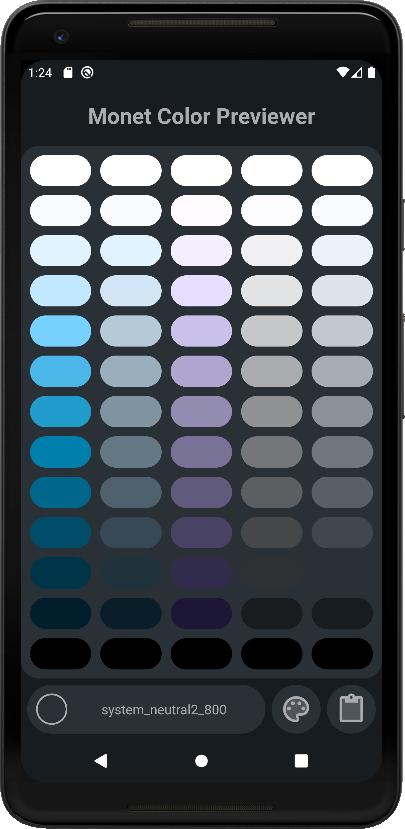
        </td>
        <td>
            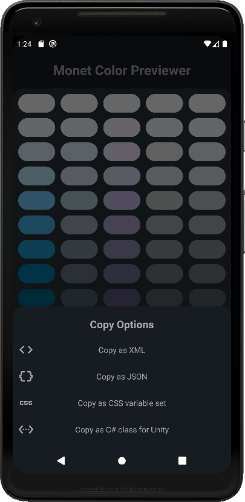
        </td>
        <td>
           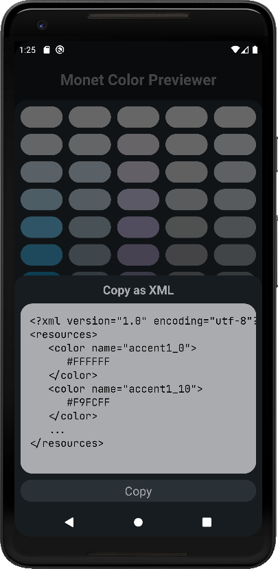
        </td>
    </tr>
</table>

<h2 align="center"> Licensing and resources </h2>

Monet Color Previewer is licensed under the [BSD 2-Clause License](./LICENSE). You can use it freely, but I do not give any warranties. Also, if you find this app useful, it will be nice of you to share it with others and not forget to give me a credit.

This project also uses external resources which are: [JetBrans Mono Font](https://www.jetbrains.com/lp/mono/) and [Google Material Icons](https://fonts.google.com/icons?icon.style=Two+tone&icon.set=Material+Icons)